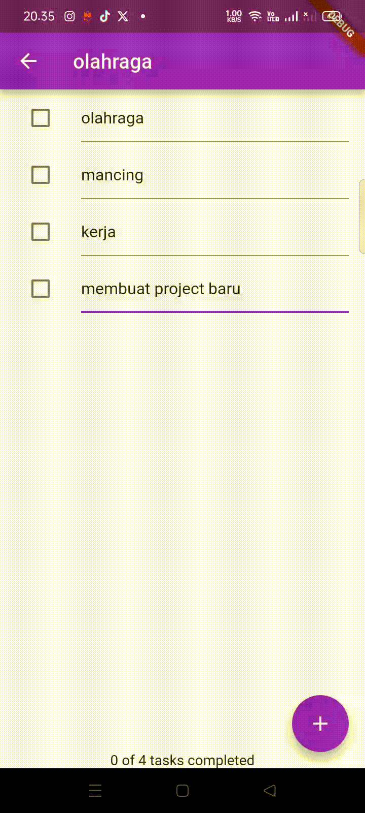
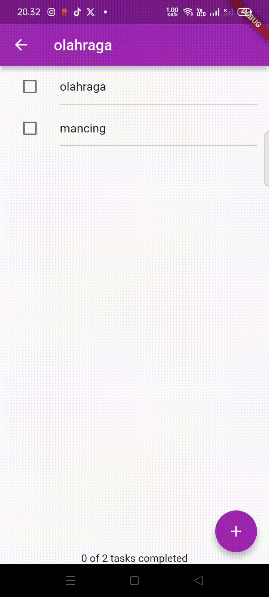
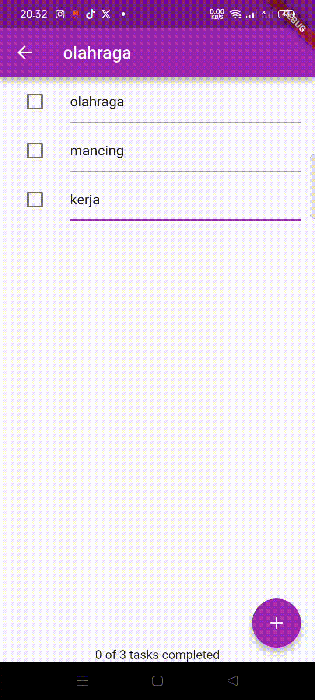
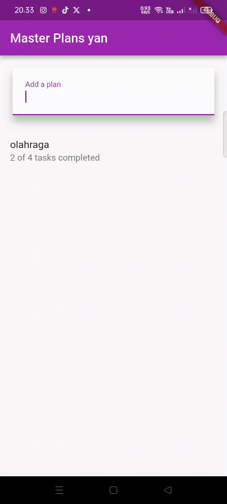

# JOBSHEET 10

## Praktikum 1: Dasar State dengan Model–View

### 1. Dokumentasi hasil praktikum

### 2. Jelaskan maksud dari langkah 4 pada praktikum tersebut! Mengapa dilakukan demikian?
**Jawab:**  
Langkah 4 dilakukan untuk menggabungkan seluruh file model ke dalam satu file ekspor agar proses import menjadi lebih sederhana. Dengan mengekspor `task.dart` dan `plan.dart` melalui `data_layer.dart`, struktur kode menjadi lebih terorganisir, mudah dikelola, dan sesuai dengan konsep pemisahan data layer dalam arsitektur aplikasi.

### 3. Mengapa perlu variabel plan di langkah 6 pada praktikum tersebut? Mengapa dibuat konstanta?
**Jawab:**  
Variabel `plan` digunakan sebagai state utama yang menyimpan daftar task yang ditampilkan pada antarmuka. Objek `Plan` dibuat sebagai konstanta karena model dirancang bersifat immutable, sehingga setiap perubahan dilakukan dengan membuat instance baru, bukan mengubah objek lama. Pendekatan ini membantu menjaga konsistensi state dan mencegah bug.

### 4. Lakukan capture hasil dari Langkah 9 berupa GIF, kemudian jelaskan apa yang telah Anda buat!

**Jawab:**  
Pada langkah 9 dibuat widget `ListTile` yang berisi `Checkbox` dan `TextFormField` untuk setiap task. Checkbox digunakan untuk menandai apakah tugas telah selesai, sedangkan `TextFormField` memungkinkan pengguna mengubah deskripsi task. Setiap perubahan langsung memperbarui state menggunakan `setState()`.

### 5. Apa kegunaan method pada Langkah 11 dan 13 dalam lifecycle state?
**Jawab:**  
Method `initState()` digunakan untuk melakukan inisialisasi awal, seperti membuat `ScrollController`, sebelum widget ditampilkan. Sementara itu, `dispose()` berfungsi untuk membersihkan resource ketika widget dihapus dari widget tree. Keduanya penting agar penggunaan resource sesuai dengan lifecycle Flutter.

---

## Praktikum 2: Mengelola Data Layer dengan InheritedWidget dan InheritedNotifier

### 2. Jelaskan mana yang dimaksud InheritedWidget pada langkah 1 tersebut! Mengapa yang digunakan InheritedNotifier?
**Jawab:**  
InheritedWidget berfungsi untuk membagikan data ke widget turunan tanpa perlu mengirimkan data melalui parameter. Namun pada praktikum ini digunakan `InheritedNotifier` karena selain mewariskan data, widget ini juga dapat memberi notifikasi ketika data berubah melalui `ValueNotifier`. Dengan demikian, UI akan otomatis diperbarui saat data `Plan` berubah.

### 3. Jelaskan maksud dari method di langkah 3 pada praktikum tersebut! Mengapa dilakukan demikian?
**Jawab:**  
Method `completedCount` dan `completenessMessage` dibuat untuk menangani perhitungan jumlah task yang telah selesai serta menampilkan pesan progres secara langsung di dalam model. Hal ini membuat kode UI lebih sederhana dan menerapkan prinsip pemisahan logika data dan tampilan.

### 4. Lakukan capture hasil dari Langkah 9 berupa GIF, kemudian jelaskan apa yang telah Anda buat!

**Jawab:**  
Pada langkah 9 tampilan aplikasi terlihat sama seperti Praktikum 1, namun pengelolaan data tidak lagi dilakukan oleh widget secara langsung. Data `Plan` kini dikelola melalui `InheritedNotifier` menggunakan `PlanProvider`, sehingga setiap perubahan task akan otomatis memicu pembaruan UI.

---

## Praktikum 3: Membuat State di Multiple Screens

### 2. Berdasarkan Praktikum 3 yang telah Anda lakukan, jelaskan maksud dari gambar diagram berikut ini!
**Jawab:**  
Diagram tersebut menjelaskan alur perpindahan state saat berpindah halaman menggunakan `Navigator.push`. Pada halaman pertama (`PlanCreatorScreen`), pengguna membuat dan memilih rencana. Ketika berpindah ke halaman kedua (`PlanScreen`), halaman tersebut memiliki state sendiri tetapi tetap terhubung dengan `PlanProvider`. Dengan demikian, perubahan data pada halaman kedua tetap memengaruhi data utama.

### 3. Lakukan capture hasil dari Langkah 14 berupa GIF, kemudian jelaskan apa yang telah Anda buat!

**Jawab:**  
Pada langkah 14 ditunjukkan bahwa pengguna dapat membuat plan baru, masuk ke halaman detail plan, menambahkan task, mengubah deskripsi, serta menandai task sebagai selesai. Semua perubahan tersebut langsung tersimpan dan ter-update, menandakan bahwa pengelolaan state antar-halaman telah berjalan dengan baik.
