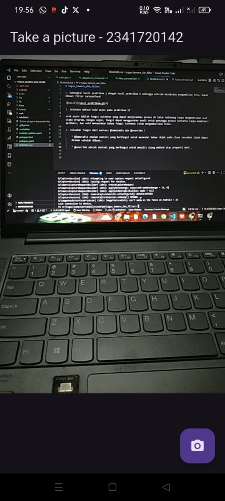
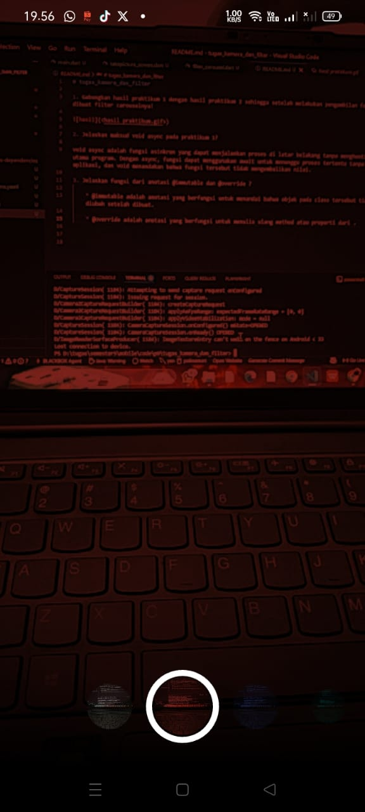

# tugas_kamera_dan_filter

1. Gabungkan hasil praktikum 1 dengan hasil praktikum 2 sehingga setelah melakukan pengambilan foto, dapat dibuat filter carouselnya!

2. Jelaskan maksud void async pada praktikum 1?

void async adalah fungsi asinkron yang dapat menjalankan proses di latar belakang tanpa menghentikan alur utama program. Dengan async, fungsi dapat menggunakan await untuk menunggu proses tertentu tanpa memblokir aplikasi, dan void menandakan bahwa fungsi tersebut tidak mengembalikan nilai.

3. Jelaskan fungsi dari anotasi @immutable dan @override ?

    * @immutable adalah anotasi yang berfungsi untuk menandai bahwa objek pada class tersebut tidak dapat diubah setelah dibuat.

    * @override adalah anotasi yang berfungsi untuk menulis ulang method atau properti dari .

